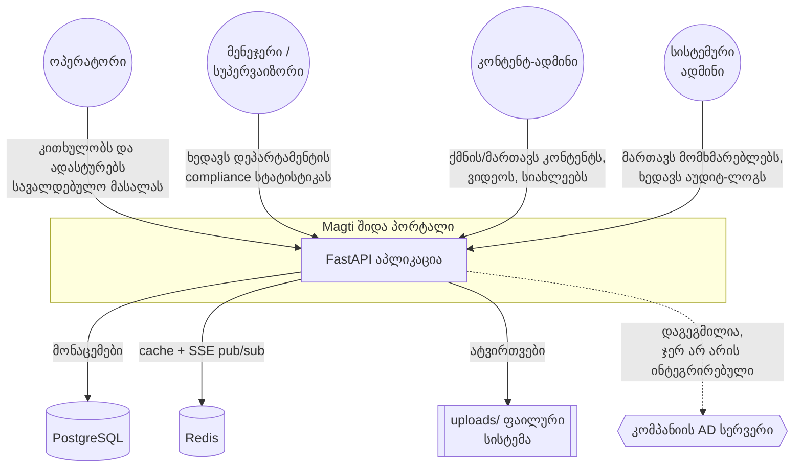
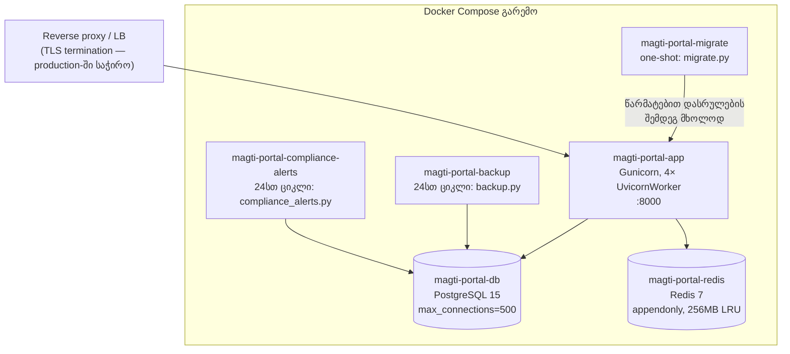
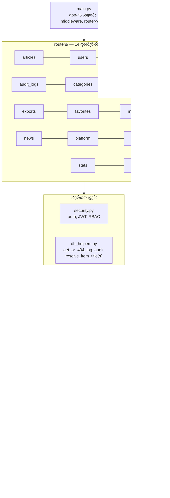
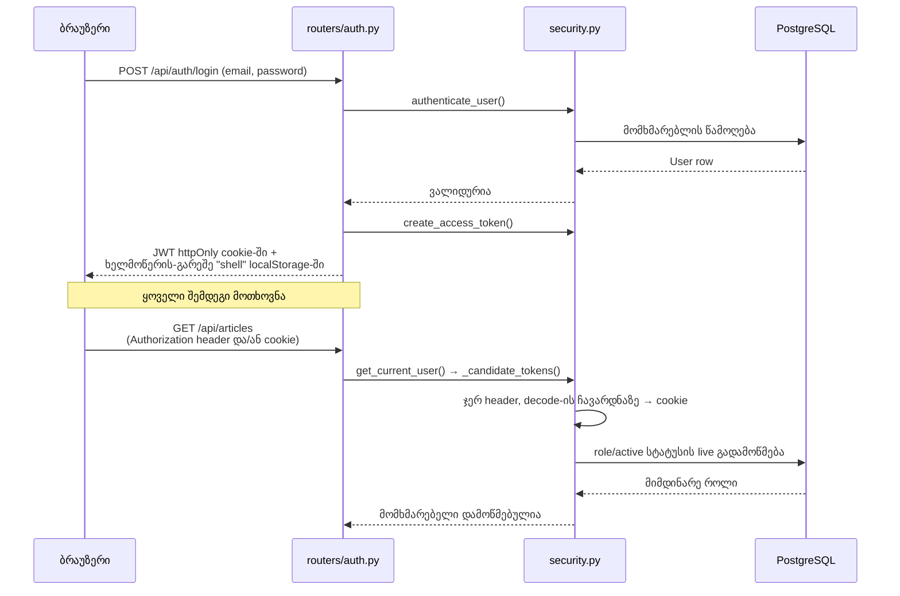
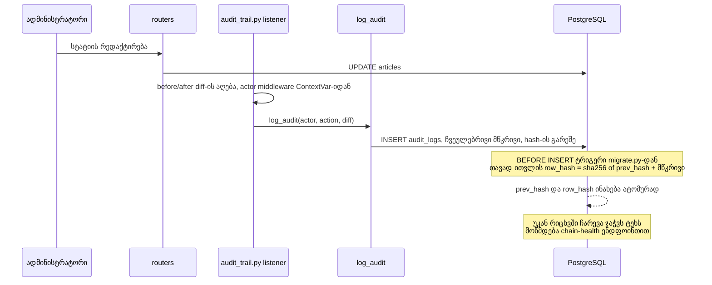

> **არქივი / Archive.** დათარიღებული ჩანაწერი — მიმდინარე კოდს აღარ აღწერს. ტექსტი უცვლელია.
> A dated record; it does not describe the current code, and its original text is unchanged. Index: [`docs/README.md`](../../README.md).

# Magti შიდა პორტალი — არქიტექტურის დოკუმენტი

> ⚠️ **Legacy snapshot:** ეს ფაილი აღწერს Python/FastAPI/PostgreSQL არქიტექტურას
> და აღარ არის მიმდინარე სისტემის source of truth. აქტიური სამიზნეა
> `angular-frontend/` + `java-backend/` (Angular, Spring Boot, Flyway, Oracle).
> მიმდინარე გადაწყვეტილებები და ეტაპები იხილეთ
> `PRODUCT_OWNER_DECISIONS_KA.md`, `ACCESS_CONTRACT_MATRIX_KA.md` და
> `IMPLEMENTATION_PLAN_KA.md` ფაილებში.

| | |
|---|---|
| **დოკუმენტის მფლობელი** | Engineering |
| **აუდიტორია** | IT დეპარტამენტი / DevOps |
| **სტატუსი** | Legacy snapshot — ისტორიული reference |
| **სტანდარტი** | სტრუქტურა [arc42](https://arc42.org)-ის მოკლე ვერსიაზეა აგებული, დიაგრამები — [C4 model](https://c4model.com)-ის კონტექსტი/კონტეინერის დონეები |
| **ბოლო განახლება** | 2026-07-20 |

> ეს დოკუმენტი პასუხობს კითხვას **"როგორ არის აწყობილი სისტემა და რატომ"**.
> "როგორ დავაყენო/გავუშვა" კითხვებზე იხილეთ [`README.md`](../README.md),
> production-ზე გადატანაზე — [`PRODUCTION_HANDOVER.md`](PRODUCTION_HANDOVER.md),
> ყოველდღიურ ადმინისტრირებაზე — [`admin-guide.md`](admin-guide.md). ეს დოკუმენტი
> მათ არ იმეორებს — მიუთითებს მათზე.

---

## 1. შესავალი და მიზნები

**რა პრობლემას წყვეტს სისტემა.** Magti-ს კონტაქტ-ცენტრის ~600 თანამშრომელს სჭირდება
ერთი ადგილი სამუშაო ინსტრუქციებისთვის, ვალდებული წასაკითხი მასალებისთვის (compliance)
და ტრენინგისთვის — ისე, რომ ხელმძღვანელობას ჰქონდეს გამჭვირვალობა, ვინ რა გაეცნო.

**ხარისხის მთავარი მიზნები** (პრიორიტეტის მიხედვით):

| # | მიზანი | რატომ |
|---|---|---|
| 1 | **უსაფრთხოება** | შიდა კორპორატიული სისტემაა პერსონალურ/სამუშაო მონაცემებზე წვდომით — არაავტორიზებული წვდომა ან მონაცემის გაყალბება მიუღებელია |
| 2 | **მხარდაჭერადობა ერთი/მცირე გუნდით** | პროექტს არ ჰყავს დამოუკიდებელი DevOps გუნდი — არქიტექტურა უნდა იყოს მარტივი ერთი ადამიანის მიერ გასაშვებად და გასამართად |
| 3 | **გამართულობა (compliance-ის სანდოობა)** | წაკითხვის სტატუსი და აუდიტ-ლოგი უნდა იყოს გაყალბებისგან დაცული — ეს არის სისტემის ბირთვის დანიშნულება |
| 4 | **წარმადობა საშუალო მასშტაბზე** | ~600 მომხმარებელი, არა მილიონები — ოპტიმიზაცია ამ მასშტაბისთვის, არა თეორიული სკეილისთვის |
| 5 | **ორენოვანი მხარდაჭერა** | ქართული + ინგლისური თანაარსებობს UI-სა და მონაცემებში |

**დაინტერესებული მხარეები**

| როლი | რა აინტერესებთ |
|---|---|
| ოპერატორები (~500+) | სწრაფად იპოვონ სწორი ინსტრუქცია, გაიგონ რა ეკისრებათ წასაკითხად |
| ხელმძღვანელები/მენეჯერები | საკუთარი დეპარტამენტის complaince-სტატუსი |
| კონტენტის ადმინისტრატორები | მარტივად გამოაქვეყნონ/განაახლონ მასალა |
| IT დეპარტამენტი | უსაფრთხო, მართვადი, გასაგები infrastructure footprint |
| სისტემის მფლობელი | ერთი ადამიანის მიერ შენარჩუნებადი კოდბაზა |

---

## 2. შეზღუდვები

| ტიპი | შეზღუდვა |
|---|---|
| ორგანიზაციული | არ არსებობს ცალკე DevOps გუნდი — ოპერირებას ვგულისხმობთ Docker Compose-ის დონეზე, არა Kubernetes-ის |
| ორგანიზაციული | Active Directory-სთან ინტეგრაცია ჯერ არ არის გადაწყვეტილი — ავტორიზაცია დღეს დამოუკიდებელია |
| ტექნიკური | უნდა გენერირდეს ქართულენოვანი PDF (DejaVu Sans ფონტი ჩაშენებულია) |
| ტექნიკური | ლოკალური დეველოპმენტი — Windows-ზე, production — Linux-კონტეინერებში |
| კონვენცია | ბილინგვური UI (ქართული/ინგლისური) — ტექსტი არასდროს "იწმინდება" ერთ ენაზე |
| კონვენცია | Surgical, incremental ცვლილებები — არა სრული ფაილების გადაწერა (იხ. `CLAUDE.md`) |

---

## 3. სისტემის კონტექსტი

**C4 — დონე 1 (Context).** ვინ/რა ურთიერთქმედებს სისტემასთან, სისტემის საზღვრების გარეშე
შიდა დეტალების ჩვენების:

---

## 4. გადაწყვეტის სტრატეგია

საკვანძო არქიტექტურული არჩევანი, ერთი შეხედვით:

| გადაწყვეტილება | ალტერნატივა, რომელიც არ არჩეულა | რატომ |
|---|---|---|
| მონოლითური FastAPI აპლიკაცია, 14 დომენ-როუტერად დაყოფილი | მიკროსერვისები | 1-2 კაცის გუნდისთვის მიკროსერვისების ოპერაციული ტვირთი (network, discovery, deploy-ორკესტრაცია) აღემატება სარგებელს ამ მასშტაბზე |
| სერვერზე რენდერილი HTML + ვანილა JS | SPA framework (React/Vue) + build pipeline | არ საჭიროებს build-ინფრასტრუქტურას, node.js toolchain-ს — deploy = ფაილების კოპირება |
| SQLite დეველოპმენტში, PostgreSQL production-ში | ერთი და იგივე ბაზა ორივეგან | SQLite ნულოვანი დაყენებით იძლევა სწრაფ ლოკალურ ციკლს; production საჭიროებს `pg_trgm`-ს და კონკურენტულ ჩაწერას, რასაც SQLite ვერ იძლევა |
| JWT + httpOnly cookie ჰიბრიდი | სუფთა JWT-ბაზირებული (localStorage) | ბრაუზერში ხელმოწერიანი ტოკენის შენახვა replay-რისკია — cookie რეალური credential-ია, JWT-ს ბრაუზერში მხოლოდ "გარსი" რჩება (იხ. §9) |
| `migrate.py` — ხელით მართული idempotent სკრიპტი | Alembic | ამ მასშტაბის სქემისთვის საკმარისია; დაფიქსირებული როგორც დროებითი გადაწყვეტა, გადასვლა დაგეგმილია (იხ. §12) |
| Docker Compose 6 კონტეინერით | Kubernetes | ~600 მომხმარებელზე ჰორიზონტალური ავტოსკეილინგის საჭიროება არ დასტურდება |

---

## 5. კონტეინერების ხედი

**C4 — დონე 2 (Container).** დეპლოის ერთეულები `docker-compose.yml`-ის მიხედვით:

| კონტეინერი | პასუხისმგებლობა |
|---|---|
| `app` | HTTP მოთხოვნების დამუშავება — ერთადერთი user-facing სერვისი |
| `db` | მუდმივი მონაცემთა შენახვა, `pg_trgm` GIN ინდექსები ძებნისთვის |
| `redis` | SSE pub/sub broker + short-TTL cache-ის ბექენდი (fallback: in-memory, იხ. §9) |
| `migrate` | სქემის bootstrap — `app`-ის სტარტს წინ უსწრებს, race-ის თავიდან ასაცილებლად |
| `backup` | 24სთ-იანი DB+uploads ასლი, ZIP არქივად |
| `compliance-alerts` | 24სთ-იანი ვადაგადაცილებული compliance-ის შემოწმება |

დეტალური deploy-ინსტრუქციები, `.env` ცვლადები და bare-metal ალტერნატივა — `PRODUCTION_HANDOVER.md` §2-3.

---

## 6. აგების ბლოკების ხედი

**C4 — დონე 3 (Component, გამარტივებული).** `main.py` არ შეიცავს არცერთ route-ს — მხოლოდ
აწყობს აპლიკაციას და აერთებს 14 დამოუკიდებელ როუტერს:

| მოდული | პასუხისმგებლობა |
|---|---|
| `security.py` | JWT გაცემა/გადამოწმება, პაროლის ჰეშირება, RBAC (`require_roles`, `require_permission`) |
| `db_helpers.py` | გაზიარებული fetch-or-404, აუდიტ-ჩანაწერის შექმნა, item-title lookup — 14 როუტერს შორის დუბლირების თავიდან ასაცილებლად |
| `state.py` | `InMemoryTTLCache` (ძებნა/კატეგორია, 60წმ TTL) და `RedisEventBroker` (SSE) — გატანილია `main.py`-დან საერთო წვდომისთვის |
| `audit_trail.py` | SQLAlchemy ORM listener-ები, რომლებიც ავტომატურად აღბეჭდავენ before/after diff-ს Article/News/Category/Video/User/RequiredReading-ზე |
| `config.py` | გარემოცვლადებზე დაფუძნებული პარამეტრები + production-startup guard (§9) |

**14 როუტერი:** `articles`, `audit_logs`, `auth`, `categories`, `compliance`, `exports`,
`favorites`, `messaging`, `news`, `platform`, `search`, `stats`, `users`, `videos` —
თითო ფაილი, თითო დომენი, ერთი კოდბაზა.

---

## 7. გაშვების ხედი

ორი წარმომადგენლობითი სცენარი — ავტორიზაცია და აუდიტის hash-chain — რადგან ორივე
გადაკვეთს რამდენიმე ფენას და ცალკეული ფაილის წაკითხვით არ ჩანს მთლიანი სურათი.

### 7.1 ავტორიზაცია და შემდგომი მოთხოვნები

**რატომაც ეს ორმაგი წყარო:** ბრაუზერს რეალური credential-ი მხოლოდ httpOnly cookie-ში
აქვს — `localStorage`-ში დარჩენილი JWT ხელმოწერის გარეშეა და ვერ გამოყენებულ იქნება
დამოუკიდებლად. ცალკე Bearer-ტოკენის კლიენტები (მაგ. ტესტები, API ინტეგრაციები) კვლავ
მუშაობენ header-ით. როლი/აქტიურობის სტატუსი ყოველ მოთხოვნაზე თავიდან მოწმდება ბაზიდან
— არა JWT-ში ჩაწერილიდან — ასე რომ დაბლოკვა/როლის ცვლილება მყისვე ძალაშია.

### 7.2 აუდიტის hash-chain ჩანაწერი

**ორი არქიტექტურულად საინტერესო წერტილი:**

1. **Actor-ის იდენტობა ORM listener-ში არ მოდის `get_current_user()`-იდან** — sync
   dependency-ები threadpool-ის კოპირებულ context-ში სრულდება, სადაც `get_current_user`-ში
   დაყენებული ContextVar დაკარგულია. ამიტომ actor-ს `main.py`-ის
   `actor_context_middleware` ცალკე ადგენს იმავე header→cookie თანმიმდევრობით.
2. **Hash-ის გამოთვლა აპლიკაციის კოდში საერთოდ არ ხდება** — Python მხოლოდ ჩვეულებრივ
   მწკრივს წერს; `row_hash`/`prev_hash`-ს PostgreSQL-ის `BEFORE INSERT` ტრიგერი ითვლის.
   ეს ნიშნავს, რომ ჯაჭვი მუშაობს იმაზეც, ვინც პირდაპირ SQL-ით ჩაწერს (თუ ვინმეს ბაზაზე
   პირდაპირი წვდომა ექნება) — ტამპერინგი აპლიკაციის შემოვლით ვერ ხდება built-in-ად.

---

## 8. დეპლოის ხედი

Production deploy = §5-ის კონტეინერების ხედი პლუს reverse proxy TLS-ტერმინაციისთვის
(აპლიკაცია TLS-ს თავად არ ამთავრებს). ალტერნატივად, systemd-ბაზირებული bare-metal
გაშვება Docker-ის გარეშეც შესაძლებელია — იხ. `PRODUCTION_HANDOVER.md` §3.4.

**მასშტაბირება:** Gunicorn worker-თა რაოდენობა (`4`) გამყარებულია `Dockerfile`-ში;
ჰორიზონტალური ზრდისთვის რეკომენდებულია რამდენიმე კონტეინერის replica load balancer-ის
უკან, ვიდრე per-container worker-ების გაზრდა — PostgreSQL-ის `max_connections=500`
ჭერის გამო. დეტალები `PRODUCTION_HANDOVER.md` §3.5.

---

## 9. მჭიდროდ გადაჯაჭვული კონცეფციები

| კონცეფცია | როგორ არის გადაწყვეტილი |
|---|---|
| **ავტორიზაცია** | JWT (HS256) + httpOnly cookie ან Bearer header, ორივე მიღებულია header-პრიორიტეტით (§7.1) |
| **RBAC** | 4 როლი (`operator`/`manager`/`content_admin`/`admin`) + წვრილმარცვლოვანი per-user უფლებები (`User.permissions`) `require_permission`-ის მეშვეობით |
| **აუდიტ-ჯაჭვი** | PostgreSQL-ტრიგერით გამოთვლილი SHA-256 hash chain — აპლიკაცია მას არც კი ხედავს (§7.2) |
| **რეალურ დროში განახლებები** | SSE, `RedisEventBroker`-ის მეშვეობით; **თუ Redis მიუწვდომელია, ავტომატურად გადადის process-local in-memory queue-ზე** (დადასტურებული ლოკალურ გაშვებაზე ამ სესიაში) — ერთი instance-ისთვის გამართულია Redis-ის გარეშეც, მაგრამ მაშინ SSE არ მუშაობს instance-ებს შორის |
| **Cache** | `InMemoryTTLCache`, 60წმ TTL, ცალკე ძებნისთვის და კატეგორიებისთვის (`state.py`) |
| **მონაცემთა შენახვის ვადა** | 180-დღიანი archive-then-purge `audit_logs`/`article_view_logs`-ზე, `retention.py`, დღიურად `backup`-ის მიერ გაშვებული |
| **Export-ის უსაფრთხოება** | CSV/XLSX უჯრედები, რომლებიც იწყება `=`/`+`/`-`/`@`/tab/CR-ით, escape-ილია ფორმულა-ინექციის (CWE-1236) თავიდან ასაცილებლად |
| **Production-startup guard** | `config.py`-ში — `APP_ENV=production`-ზე აპლიკაცია საერთოდ არ ჩაიტვირთება, თუ `SECRET_KEY` ჯერ კიდევ dev-default-ია ან `COOKIE_SECURE=false` |
| **ბილინგვურობა** | ქართული/ინგლისური თანაარსებობს ტემპლეიტებში, ვალიდაციის შეტყობინებებში — არ იშლება refactor-ისას |

---

## 10. ხარისხის მოთხოვნები (მოკლედ)

| ატრიბუტი | კონკრეტული მოთხოვნა/მიდგომა |
|---|---|
| წარმადობა | `pg_trgm` + GIN ინდექსები → sub-2წმ `ILIKE` ძებნა დიდ მოცულობაზეც |
| ხელმისაწვდომობა | `HEALTHCHECK` (`curl -f http://localhost:8000/`) orchestrator-level readiness-ისთვის |
| უსაფრთხოება | RBAC live re-check ყოველ მოთხოვნაზე, rate limiting login-ზე, upload allow-list, secrets `.env`-ით |
| მხარდაჭერადობა | 14 დამოუკიდებელი როუტერი > ერთი 4000+ ხაზიანი ფაილი; საერთო helper-ები დუბლირების საწინააღმდეგოდ |

---

## 11. საკვანძო არქიტექტურული გადაწყვეტილებები (ADR-ლაიტი)

**ADR-1 — მონოლითი, არა მიკროსერვისები**
_კონტექსტი:_ 1-2 კაცის გუნდი, ~600 შიდა მომხმარებელი.
_გადაწყვეტილება:_ ერთი deploy-ერთეული, დომენებად დაყოფილი კოდის დონეზე (`routers/`), არა
პროცესის/ქსელის დონეზე.
_შედეგი:_ მარტივი deploy და დებაგი; ფასი — მთელი აპლიკაცია ერთად სკეილდება.

**ADR-2 — JWT + httpOnly cookie ჰიბრიდი, არა სუფთა localStorage JWT**
_კონტექსტი:_ ხელმოწერიანი ტოკენი JS-წვდომად საცავში replay-რისკია XSS-ის შემთხვევაში.
_გადაწყვეტილება:_ რეალური credential — მხოლოდ httpOnly cookie; `localStorage`-ს რჩება
არარეპლიცირებადი "გარსი" (header+payload, ხელმოწერის გარეშე).
_შედეგი:_ ბრაუზერის `Authorization` header აღარ არის სანდო წყარო production-კლიენტისთვის
— `security.py` ორივეს იღებს, header-პრიორიტეტით.

**ADR-3 — `migrate.py`, დროებით არა Alembic**
_კონტექსტი:_ სქემა ჯერ მარტივია, ცვლილებები იშვიათია.
_გადაწყვეტილება:_ ხელით მართული idempotent სკრიპტი, ცალკე one-shot კონტეინერად
(race-ის თავიდან ასაცილებლად app-ის სტარტთან).
_შედეგი:_ არ არსებობს rollback/down-migration მექანიზმი — მხოლოდ დამატება, არასდროს წაშლა.

**ADR-4 — Hash-chain PostgreSQL ტრიგერით, არა აპლიკაციის კოდში**
_კონტექსტი:_ tamper-evidence უნდა იყოს true მაშინაც, თუ ვინმე პირდაპირ SQL-ს იყენებს.
_გადაწყვეტილება:_ `BEFORE INSERT` ტრიგერი `audit_logs`-ზე ითვლის hash-ს, არა Python.
_შედეგი:_ SQLite dev-გარემოში ჯაჭვი არ არსებობს (Postgres-only ფუნქციები) — მხოლოდ
production-ში მოწმდება რეალურად.

---

## 12. რისკები და ტექნიკური ვალი

დეტალური, ოპერაციული სიისთვის იხილეთ `PRODUCTION_HANDOVER.md` §7 (Outstanding Risks
Before Go-Live) — არ ვიმეორებთ აქ, რადგან სწრაფად ძველდება. არქიტექტურული დონის
პუნქტები, რომლებიც სცდება ცალკეულ deploy-checklist-ს:

- **არ არსებობს Alembic** — სქემის ევოლუციის გზა ჯერ ერთფეროვანია (მხოლოდ დამატება).
  გახდება პრობლემა, როცა საჭირო გახდება სვეტის წაშლა/ტიპის შეცვლა.
- **AD-ინტეგრაცია არქიტექტურულად არ არის დაპროექტებული, მხოლოდ შესაძლებელი** — §3-ის
  წყვეტილი ხაზი წარმოადგენს განზრახვას, არა არსებულ კონტრაქტს.
- **SSE მრავალ instance-ს შორის Redis-ზეა დამოკიდებული** — ერთი instance-ის ფარგლებში
  fallback მუშაობს, მაგრამ ჰორიზონტალური სკეილირებისას Redis სავალდებულო ხდება.

---

## 13. ლექსიკონი

| ტერმინი | მნიშვნელობა |
|---|---|
| JWT | JSON Web Token — ხელმოწერილი, თვითშემცველი ავტორიზაციის ტოკენი |
| RBAC | Role-Based Access Control — წვდომის კონტროლი როლის მიხედვით |
| SSE | Server-Sent Events — სერვერიდან ბრაუზერისკენ ცალმხრივი რეალურდროული არხი |
| GIN ინდექსი | PostgreSQL-ის ინდექსის ტიპი, სასარგებლო ტექსტური ძებნისთვის (`pg_trgm`-თან ერთად) |
| Idempotent მიგრაცია | სკრიპტი, რომლის მრავალჯერ გაშვებაც იძლევა ერთსა და იმავე შედეგს |
| Hash chain | ჩანაწერების ჯაჭვი, სადაც თითოეული შეიცავს წინას hash-ს — უკან ჩარევა ჯაჭვს არღვევს |
| ContextVar | Python-ის მექანიზმი request-ის მასშტაბით მდგომარეობის შესანახად async/thread ზღვრებს შორის |

---

*ეს დოკუმენტი აღწერს არქიტექტურას კონცეფციის დონეზე. ზუსტი ხაზების ნომრებისთვის და
კონფიგურაციის დეტალებისთვის იხილეთ `PRODUCTION_HANDOVER.md` და თავად კოდი — ეს ორი
წყარო ცვლილებასთან ერთად უფრო სწრაფად ძველდება, ვიდრე არქიტექტურული სურათი.*
